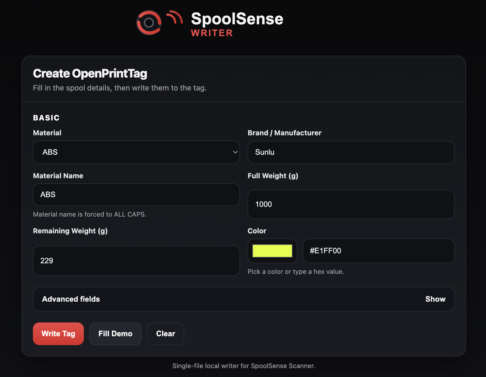
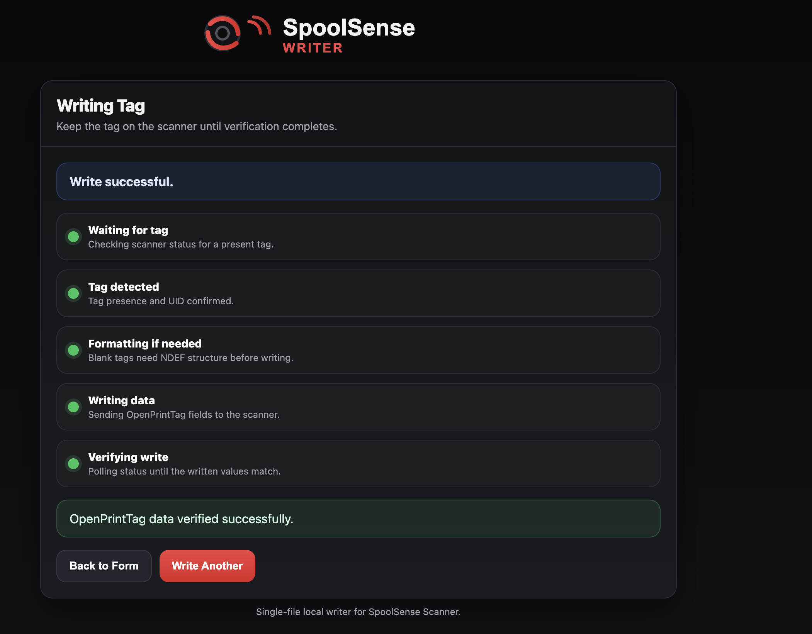

<p align="center">
  
</p>

# SpoolSense Scanner

## Overview
SpoolSense Scanner is an ESP32-based NFC scanner designed for managing 3D printer filament spools using NFC tags. It integrates with the SpoolSense ecosystem and supports multiple NFC tag formats including OpenPrintTag and TigerTag.

The scanner allows users to tap a filament spool to identify it, retrieve metadata from the NFC tag, and trigger external automation or spool tracking workflows. A built-in web UI at `spoolsense.local` provides tag reading, writing, and over-the-air firmware updates — no apps or external tools required.

## Web UI

After connecting to WiFi, open **`http://spoolsense.local`** from any browser on your local network. The landing page provides access to all tools:

- **Tag Reader** — Auto-detects tag format (OpenPrintTag, TigerTag, generic UID) and displays all data read-only
- **OpenPrintTag Writer** — Write filament data to ISO15693 tags using the OpenPrintTag format
- **TigerTag Writer** — Write filament data to NTAG213/215 tags using the TigerTag binary format
- **Firmware Update** — Check for new firmware versions from GitHub, view release notes, and update over WiFi with one click

<p align="center">
  <a href="docs/writerwebui2.png"></a>
  &nbsp;&nbsp;
  <a href="docs/writerwebui1.png"></a>
</p>

## Features

* **Multi-format NFC Support:** Read and write OpenPrintTag (ISO15693) and TigerTag (ISO14443A NTAG213/215) tags. UID-only tags are also detected for Spoolman registration.
* **Built-in Tag Writer:** Write filament metadata directly from the web UI — material, manufacturer, weight, color, density, diameter, temperatures, and Spoolman ID.
* **Tag Reader:** Auto-detect any supported tag format and display all data in a clean read-only view.
* **OTA Firmware Updates:** Check for updates from GitHub releases with release notes, one-click download and flash, or manual .bin upload. Dual partition layout with automatic rollback on failed update.
* **Home Assistant Integration:** Publishes spool state via MQTT with full HA discovery support.
* **Automatic Spoolman Registration:** When a tagged spool is scanned, the scanner automatically creates or updates the spool entry in Spoolman — no manual data entry needed. If a tag is re-written with different filament, the old spool is automatically archived and a new one created. Requires the `nfc_id` extra field in Spoolman (the installer can create this for you).
* **LCD Display (optional):** Displays device status, NFC scan results, and system information.
* **Status LED:** Visual feedback for boot, WiFi, tag detection, write progress, and filament color display.

## Supported Tag Formats

| Format | Protocol | Support |
|--------|----------|---------|
| OpenPrintTag | ISO15693 | Full read/write — CBOR/NDEF filament data, weight tracking, Spoolman sync |
| TigerTag | ISO14443A (NTAG213/215) | Full read/write — binary format with material, brand, color, weight, temperatures |
| UID-only (NTAG215, etc.) | ISO14443A | UID detected and published; middleware looks up spool by UID |

- OpenPrintTag spec: [openprinttag.org](https://openprinttag.org/generator/)
- TigerTag spec: [TigerTag RFID Guide](https://github.com/TigerTag-Project/TigerTag-RFID-Guide)

## Installation

### Option 1: SpoolSense Installer (recommended)

The installer handles everything — firmware download, WiFi/MQTT/Spoolman configuration, and flashing:

```bash
curl -sL https://raw.githubusercontent.com/SpoolSense/spoolsense-installer/main/install.sh | bash
```

Configuration is stored in NVS (non-volatile storage) and survives OTA firmware updates.

### Option 2: Build from Source

1. Install [PlatformIO](https://platformio.org/)
2. Copy the example config: `cp include/UserConfig.example.h include/UserConfig.h`
3. Edit `include/UserConfig.h` with your settings (WiFi, MQTT, Spoolman, etc.)
4. Flash:
   - **WROOM:** `pio run -e esp32dev -t upload`
   - **S3-Zero:** `pio run -e esp32s3zero -t upload`
5. **Important for OTA updates:** Run the installer in "Config only" mode to write your settings to NVS. Without this, OTA updates will overwrite your compiled-in settings with defaults.
   ```bash
   curl -sL https://raw.githubusercontent.com/SpoolSense/spoolsense-installer/main/install.sh | bash
   ```
   Select **"Config only (source builds)"** when prompted.

## OTA Firmware Updates

Once the scanner is running, navigate to `spoolsense.local/update` to:

1. **Check for Updates** — Fetches the latest release from GitHub, displays version and release notes
2. **Update Now** — Downloads and flashes the new firmware automatically. Progress is tracked in real-time
3. **Manual Upload** — Upload a `.bin` file directly for offline updates or beta testing

The device uses dual OTA partitions — if an update fails, the bootloader automatically rolls back to the previous working firmware. NVS configuration (WiFi, MQTT, Spoolman) is preserved across updates.

# Hardware Setup

## Hardware Needed
*   NFC Reader/Writer: PN5180 NFC module (ISO 15693 + ISO 14443A)
*   ESP32: One of the following supported boards:
    - **ESP32-WROOM-32** — e.g. [ESP32 DevKitC V4](https://a.co/d/gW3zBIJ). Primary development board.
    - **ESP32-S3-Zero** — Smaller form factor with onboard WS2812 RGB LED and USB-C (no external UART chip needed).
*   USB Cable: USB-A to USB-C (1)
*   Jumper wires: male-to-female Dupont wires (9)
*   LCD Screen: [16x2 I2C LCD](https://a.co/d/dryhwvd) (optional)
*   Status LED: SK6812 RGBW (WROOM, optional external) or onboard WS2812 RGB (S3-Zero, built in)

## Wiring — ESP32-WROOM-32

**PN5180 NFC Module (SPI, right side of ESP32 top to bottom, skipping D12):**

| PN5180 Pin | ESP32 Pin | Direction | Notes |
|------------|-----------|-----------|-------|
| RST        | D13       | Output    | Hardware reset (active low) |
| *(skip)*   | *D12*     | *—*       | *Strapping pin, skip* |
| NSS        | D14       | Output    | SPI chip select (active low) |
| MOSI       | D27       | Output    | SPI data to PN5180 |
| MISO       | D26       | Input     | SPI data from PN5180 |
| SCK        | D25       | Output    | SPI clock |
| BUSY       | D33       | Input     | SPI flow control |
| GPIO       | D32       | Input     | Card detection (future use) |
| IRQ        | D35       | Input     | Interrupt, active HIGH (input-only pin, no pull-up) |
| AUX        | D34       | Input     | Auxiliary monitoring (input-only pin, no pull-up) |
| REQ        | —         | —         | **Not connected.** Only needed for PN5180 firmware updates. |
| VIN        | 5V        | Power     | |
| GND        | GND       | Power     | |

> **Note:** D35 and D34 are input-only pins on the ESP32 (no internal pull-up). D12 is a strapping pin and is skipped.

**16x2 I2C LCD (optional):**

| LCD Pin | ESP32 Pin |
|---------|-----------|
| GND | GND |
| VCC | 5V |
| SDA | GPIO 23 |
| SCL | GPIO 22 |

**SK6812 RGBW Status LED (optional):**

> A single SK6812 RGBW LED module is recommended. Many small breakout boards include the necessary capacitor and resistor already. If using a bare LED, a ~330 resistor on the data line is recommended for signal stability. A common ground between the ESP32 and the LED is required.

| LED Pin | ESP32 Pin |
|---------|-----------|
| VCC | 5V or 3.3V |
| GND | GND |
| DIN | GPIO 4 |

## Wiring — ESP32-S3-Zero

The S3-Zero has a smaller pin count. The PN5180 and LCD (if used) share the same 5V and GND pins — daisy-chain or splice the power wires to connect both devices. Total draw is ~140mA (PN5180 ~100mA during RF + LCD ~40mA backlight), well within the USB 500mA budget.

**PN5180 NFC Module (SPI):**

| PN5180 Pin | S3-Zero Pin | Direction | Notes |
|------------|-------------|-----------|-------|
| RST        | GPIO 4      | Output    | Hardware reset (active low) |
| NSS        | GPIO 5      | Output    | SPI chip select (active low) |
| MOSI       | GPIO 6      | Output    | SPI data to PN5180 |
| MISO       | GPIO 7      | Input     | SPI data from PN5180 |
| SCK        | GPIO 8      | Output    | SPI clock |
| BUSY       | GPIO 9      | Input     | SPI flow control |
| GPIO       | GPIO 10     | Input     | Card detection (future use) |
| IRQ        | GPIO 11     | Input     | Interrupt, active HIGH |
| AUX        | GPIO 12     | Input     | Auxiliary monitoring (future use) |
| REQ        | —           | —         | **Not connected.** |
| VIN        | 5V          | Power     | Shared with LCD (daisy-chain) |
| GND        | GND         | Power     | Shared with LCD (daisy-chain) |

**16x2 I2C LCD (optional):**

| LCD Pin | S3-Zero Pin |
|---------|-------------|
| GND | GND (shared with PN5180) |
| VCC | 5V (shared with PN5180) |
| SDA | GPIO 1 |
| SCL | GPIO 2 |

> **Note:** The LCD module needs 5V on VCC for display contrast. The I2C SDA/SCL lines run at 3.3V logic, which the PCF8574 backpack accepts without a level shifter.

**Status LED:** The S3-Zero has an onboard WS2812 RGB LED on GPIO 21 — no external LED or wiring needed. If compiling from source, enable it with `#define ENABLE_STATUS_LED 1` in `UserConfig.h`. The installer enables it by default.

**Serial:** The S3-Zero uses USB CDC — just plug in a USB-C cable, no external UART adapter needed.

# Configuration

## UserConfig.h (source builds only)
1. Copy the example config: `cp include/UserConfig.example.h include/UserConfig.h`
2. Edit `include/UserConfig.h` and fill in your settings:
   - WiFi SSID and password
   - MQTT broker host, port, and credentials
   - Spoolman URL (optional)
   - Automation mode (`0` = Self Directed, `1` = Controlled by HA)
   - Board selection (`BOARD_ESP32_WROOM` or `BOARD_ESP32_S3`)
   - Optional hardware: LCD and status LED (see below)
3. Flash the firmware:
   - **WROOM:** `pio run -e esp32dev -t upload`
   - **S3-Zero:** `pio run -e esp32s3zero -t upload`

> **Note:** If you used the SpoolSense Installer, configuration is stored in NVS and you don't need `UserConfig.h`.

## Optional: LCD

The 16x2 I2C LCD is fully optional. If compiling from source, set in `UserConfig.h`:

```cpp
#define ENABLE_LCD 0
```

When disabled, no I2C bus is initialized, no LCD task is started, and no LCD code is compiled into the binary. Set to `1` if you have the LCD connected. The installer disables it by default.

## Optional: Status LED

The status LED is optional. If compiling from source, set in `UserConfig.h`:

```cpp
#define ENABLE_STATUS_LED 1   // 1 = enabled, 0 = disabled
```

- **ESP32-S3-Zero:** Uses the onboard WS2812 RGB LED on GPIO 21 — no external wiring needed.
- **ESP32-WROOM-32:** Requires an external SK6812 RGBW LED wired to GPIO 4 (see wiring table above).

Pin mapping is automatic via `BoardPins.h` — no need to configure the pin manually.

## Status LED Reference

| Event | LED Behavior |
|------|--------------|
| Booting | White (RGBW W channel on WROOM, RGB white on S3) |
| WiFi connected | Cyan |
| Ready | Blue |
| Tag detected | 3 white flashes |
| Valid spool tag | Filament color (solid); breathing if ≤100g remaining |
| Generic/UID-only tag | 3 white flashes, then off |
| Blank/invalid tag | Red flash, then off |
| Tag removed | Color persists — stays at last scanned filament color |
| Write success | Green flash, then restores filament color |
| Write failure | Red flash, then restores filament color |

## Contributing & Help Wanted

> **This project is currently in Alpha.** Testing is being done by myself and one other person. There will be bugs — please help!

**How you can help:**

- **Beta testers** — If you build one, I'd love to hear how it goes. Try it out and [open an issue](https://github.com/SpoolSense/spoolsense_scanner/issues) with any bugs or feedback you find.
- **Case design** — I have zero CAD skills. If you're handy with Fusion 360, FreeCAD, or anything similar, I'd love a printable enclosure that fits the ESP32 + PN5180 + optional LCD. Open an issue or reach out.
- **Bug reports & feedback** — Even general impressions are helpful. If something doesn't work the way you'd expect, please open an issue.

## Credits

This project is derived from and inspired by the original **openprinttag_scanner** project created by Ryan C.

* Original project: https://github.com/ryanch/openprinttag_scanner

SpoolSense Scanner builds on that foundation while adapting the firmware for the **SpoolSense ecosystem**, adding features such as multi-format NFC support, a web-based tag writer and reader, TigerTag support, OTA firmware updates, and hardware profile support for multiple ESP32 variants.

Many thanks to the original author and contributors for the work that made this project possible.

### Libraries Used

* **PN5180 Library** by Andreas Trappmann — ISO15693 and ISO14443A NFC driver for the PN5180 module: https://github.com/ATrappmann/PN5180-Library/

## Specs Referenced
*   OpenPrintTag: https://openprinttag.org/generator/
*   TigerTag RFID Guide: https://github.com/TigerTag-Project/TigerTag-RFID-Guide
*   TigerTag SpoolmanDB: https://github.com/TigerTag-Project/TigerTag-RFID-Guide/tree/main/SpoolmanDB
*   Spoolman API: https://donkie.github.io/Spoolman/#tag/filament/operation/Find_filaments_filament_get
