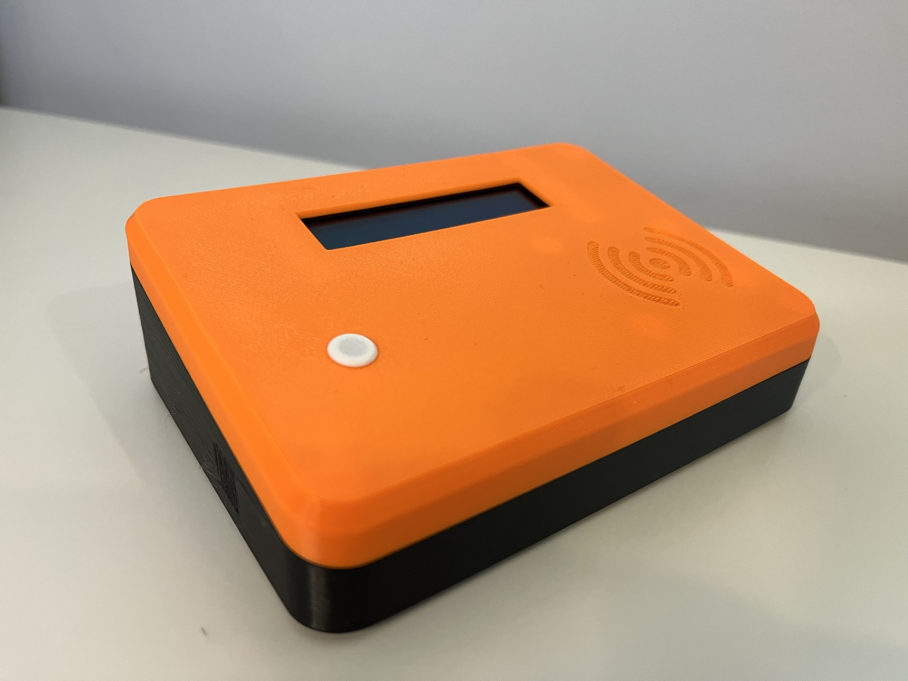
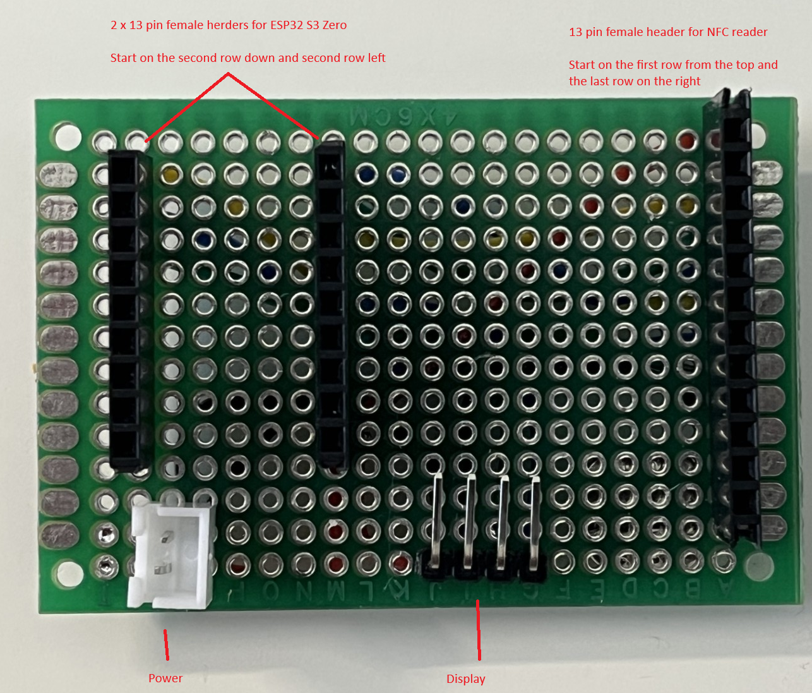
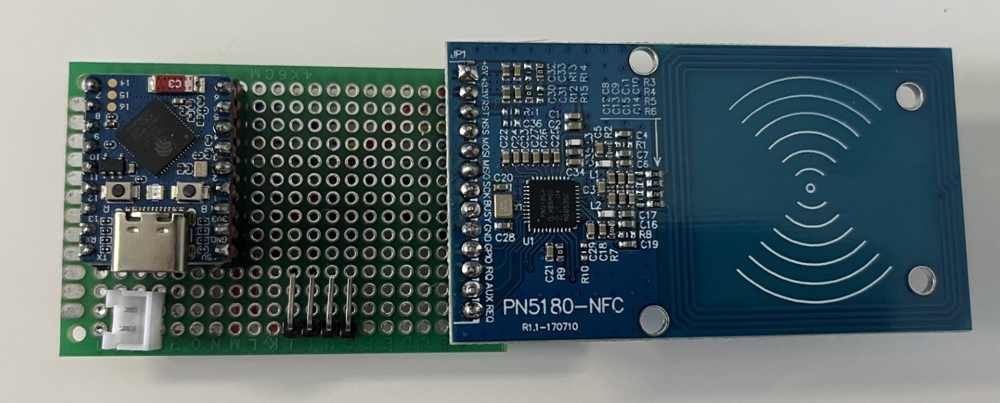
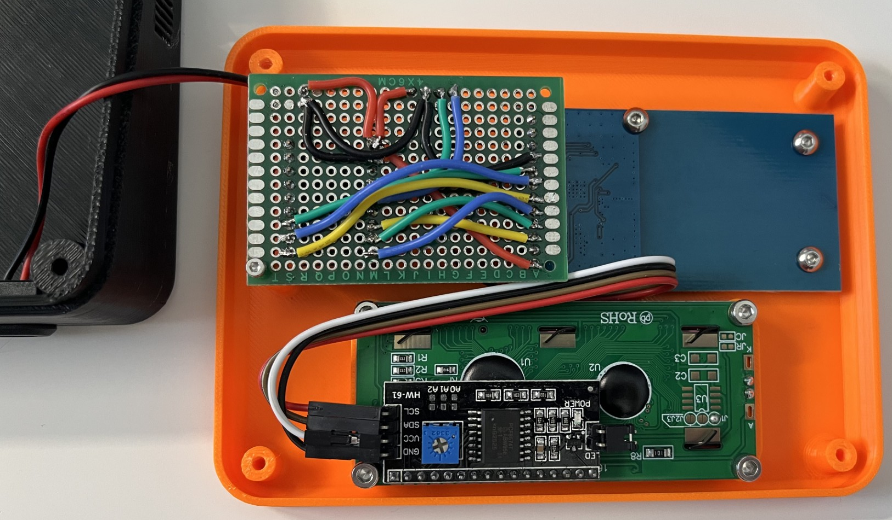
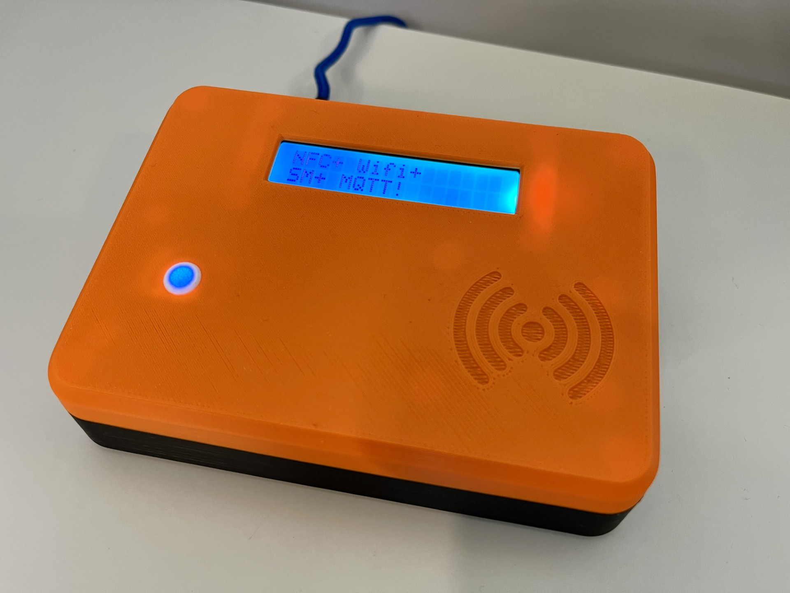

# PlasticSnake's Standalone Enclosure

A 4-part standalone enclosure for the SpoolSense scanner designed for the **ESP32-S3-Zero + PN5180 + 16x2 I2C LCD** hardware configuration.

This design aims to create a clean, desk-friendly scanner unit that is easy to print, assemble, and use while keeping the NFC antenna as close as possible to the scan surface for reliable reads.

It is designed as a fully self-contained unit, making it well suited for use next to a printer or filament storage area.

## Parts

| File | Description |
|------|-------------|
| `Top` | Houses the display opening and NFC scan surface |
| `Bottom` | Mounting base for electronics with internal standoffs |
| `LED Diffuser` | Light diffuser for status LEDs |
| `Foot` | Optional TPU feet |

## Print Notes

### Top

- No supports required

### Bottom

- Includes internal standoffs
- Supports required only for the 4 corner standoffs

### LED Diffuser

- Light diffuser for status LEDs
- Print in white or transparent filament for best effect
- Recommended 0.1mm layer height

### Foot (optional)

- Print 4 feet
- Print with TPU

## Print Settings

| Setting | Recommended |
|---------|-------------|
| Material | PLA or PETG |
| Layer Height | 0.2mm |
| Infill | 15-20% |
| Supports | Bottom only, for the 4 corner standoffs |

## Bill Of Materials

- ESP32-S3-Zero (https://www.aliexpress.com/item/1005009890203011.html)
- PN5180 NFC RF sensor (https://www.aliexpress.com/item/1005010338513783.html)
- LCD1602 I2C display with PCF8574 adapter (https://www.aliexpress.com/item/1005006100081942.html)
- 4x6 double-sided prototype PCB board (https://www.aliexpress.com/item/4000300483401.html)
- USB charging port module (https://www.aliexpress.com/item/1005006544322183.html)
- JST connector kit (2-pin and 4-pin) (https://www.aliexpress.com/item/33009421559.html)
- 2.54mm male and female breakaway pin headers (https://www.aliexpress.com/item/1005007235591794.html)
- 4 x M3 x 4mm screws for the PN5180 board
- 4 x M3 x 5mm screws for the LCD screen
- 4 x M3 x 5mm screws to hold the case together
- 2 x M2 x 6mm screws for the prototype PCB

## Build Notes

- STL download: https://www.printables.com/model/1698547-spoolsense-standalone-scanner-case-esp32-s3-zero-p
- Follow the main SpoolSense project for firmware, wiring, and setup guidance: https://spoolsense.org/intro/
- This enclosure is part of the SpoolSense ecosystem and is intended for a standalone scanner build.

### PCB Layout Diagram

### Finished PCB Photo

### Completed Setup Photo

## Author

PlasticSnake